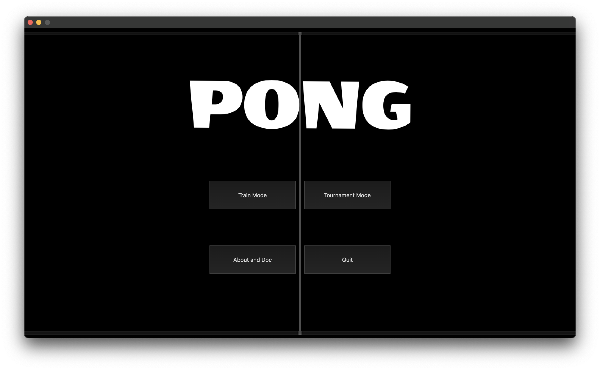
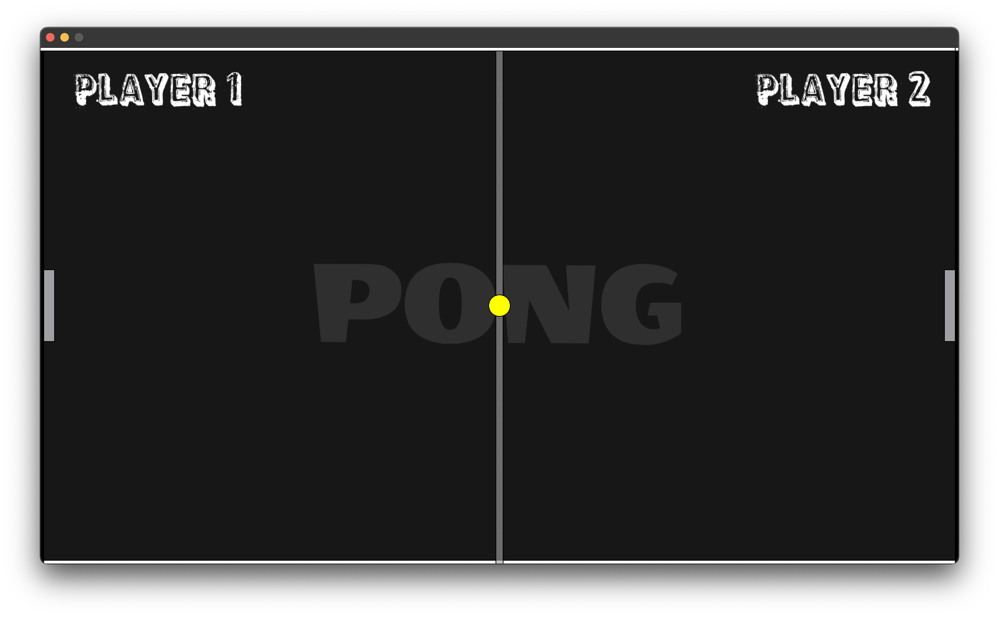

   
 

 #
Pong is one of the first computer games that ever created, this simple 
"tennis like" game features two paddles and a ball.

It works on `Qt 6.0` version and above.

`Main menu:`

   

`Tournament mode of game:`

   

